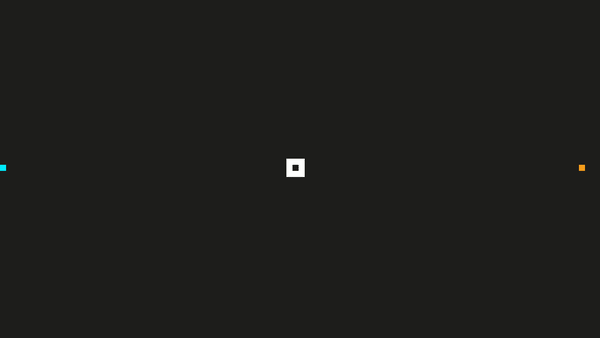

# TRON

Hello user,

welcome to the Grid. 

The programs have noticed your arrival. That is why you will have to prove yourself in the arena. It is only you, your Light Cycle and the enemy.

Your Light Cycle is powered by pure liquid energy, it has two speed modes and the Light Ribbons it produces can be toggled on or off at any time. Let your opponent ride into them and you will win the game.

In the center you can find a portal which will teleport you to a random location inside the arena. But be careful, it might as well beam you into the Light Ribbon of your enemy.

If you can overcome this challenge, the grid will light up in your color.

## Controls

* Press any key to start.
* Directional controls
  * User (blue): WASD
  * Program (orange): IJKL
* Activate and deactivate the Light Ribbon
  * User (blue): E
  * Program (orange): O
* Toggle between high and low speed
  * User (blue): Q
  * Program (orange): U
* Press enter to repeat.

## How can I enter the grid?

1. Clone this repo.
2. Get all dependencies.
3. Make a build directory in the top level directory: `mkdir build && cd build`
4. Compile: `cmake .. && make`
5. Run it: `./Tron`.

  *Web build may follow soon.*

## Dependencies for Running Locally

This project was built using only C++ and SDL2.

* cmake >= 3.7
  * All OSes: [click here for installation instructions](https://cmake.org/install/)
* make >= 4.1 (Linux, Mac), 3.81 (Windows)
  * Linux: make is installed by default on most Linux distros
  * Mac: [install Xcode command line tools to get make](https://developer.apple.com/xcode/features/)
  * Windows: [Click here for installation instructions](http://gnuwin32.sourceforge.net/packages/make.htm)
* SDL2 >= 2.0
  * All installation instructions can be found [here](https://wiki.libsdl.org/Installation)
  >Note that for Linux, an `apt` or `apt-get` installation is preferred to building from source. 
* gcc/g++ >= 5.4
  * Linux: gcc / g++ is installed by default on most Linux distros
  * Mac: same deal as make - [install Xcode command line tools](https://developer.apple.com/xcode/features/)
  * Windows: recommend using [MinGW](http://www.mingw.org/)

## CC Attribution-ShareAlike 4.0 International

Shield: [![CC BY-SA 4.0][cc-by-sa-shield]][cc-by-sa]

This work is licensed under a
[Creative Commons Attribution-ShareAlike 4.0 International License][cc-by-sa].

[![CC BY-SA 4.0][cc-by-sa-image]][cc-by-sa]

[cc-by-sa]: http://creativecommons.org/licenses/by-sa/4.0/
[cc-by-sa-image]: https://licensebuttons.net/l/by-sa/4.0/88x31.png
[cc-by-sa-shield]: https://img.shields.io/badge/License-CC%20BY--SA%204.0-lightgrey.svg

## Class structure

* Controller: A class that handles all input events
* Game: Contains the main game loop (Input, Update, Render) and keeps track of the frame rate. It has two instances of the player class as attributes.
* Player: Handles the logic (position, movement and collision detection)
* Renderer: Draws player, portal, etc. to the screen
* Portal: encapsulates random number generating engine and posiiton of the portal

## Adressed rubric points

> The project demonstrates an understanding of C++ functions and control structures.

Several functions and conditionals were used throughout the program. Example: `controller.cpp` line 6

> The project accepts user input and processes the input.

The controller class handles all keyboard input.

> The project uses Object Oriented Programming techniques.
> Classes encapsulate behavior.

One example could be the Portal class in portal.h that encapsulates a random number generating engine.

> Class constructors utilize member initialization lists.

This can be found in almost all classes. Example: `portal.h` line 9

> The project makes use of references in function declarations.

Examples: `controller.cpp` line 6 or `game.cpp` line 11

I am sure there are other rubric points to be found in addition to those that are mentioned above.
